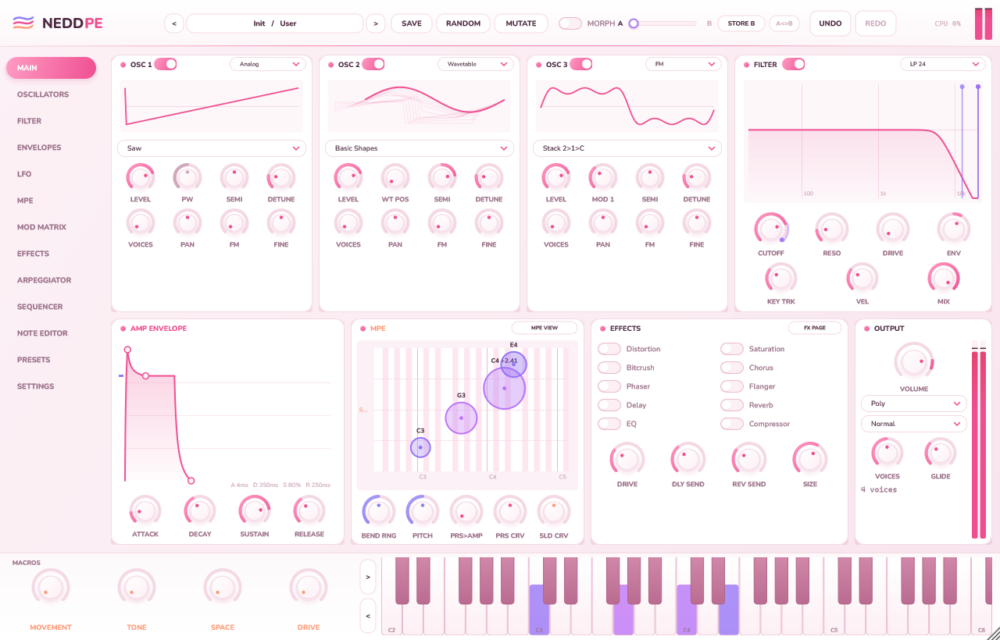
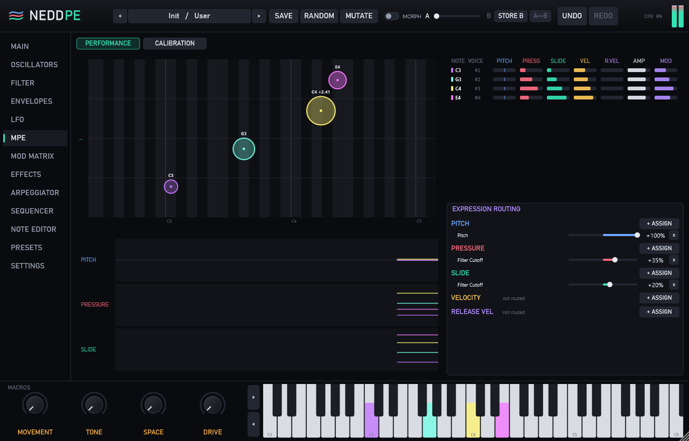
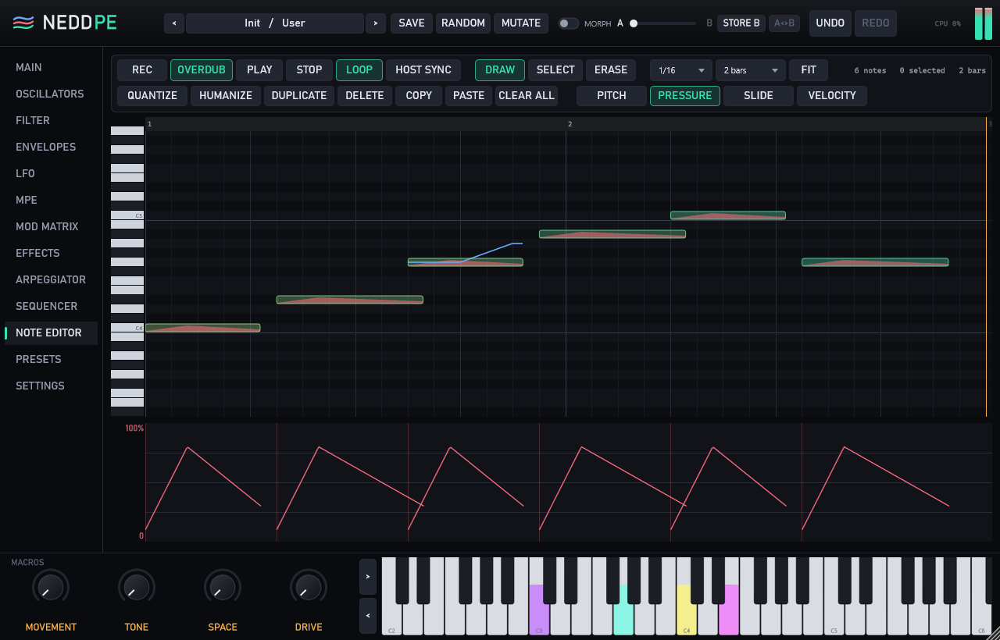
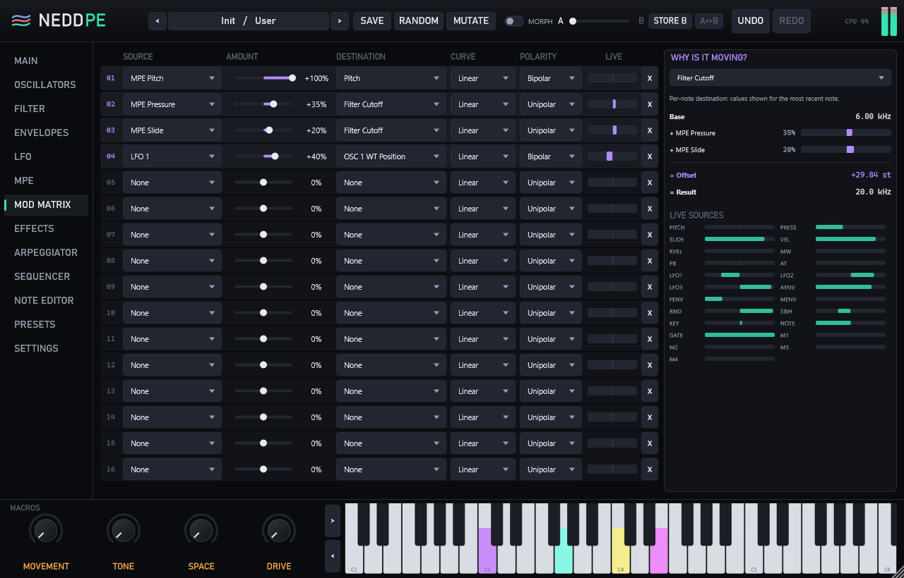
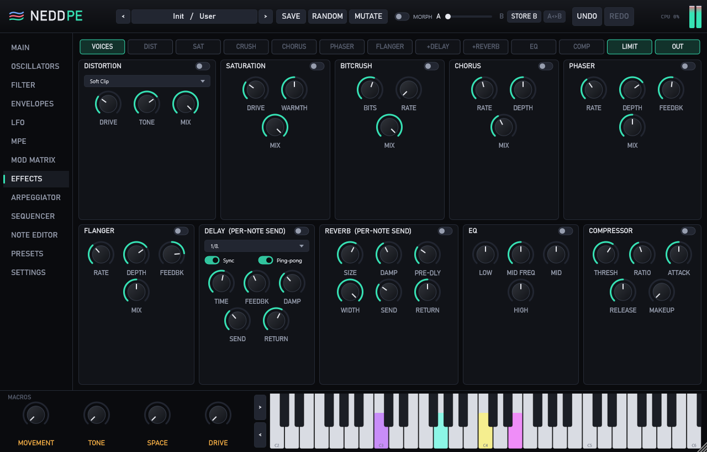
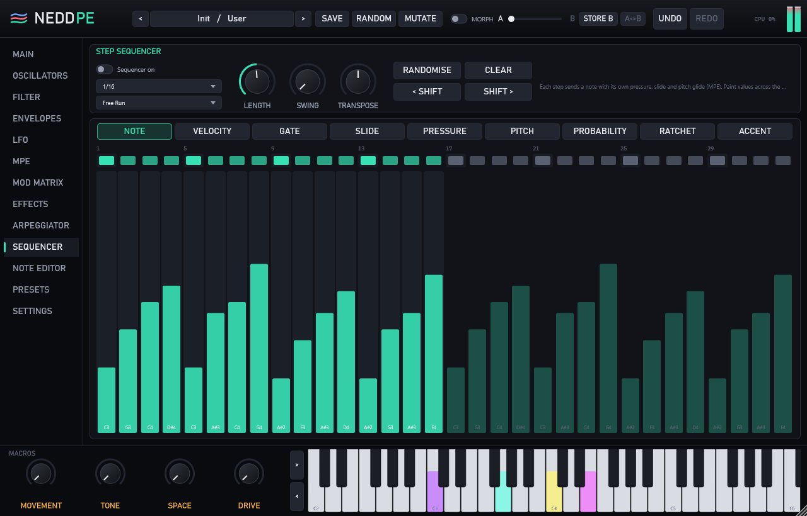
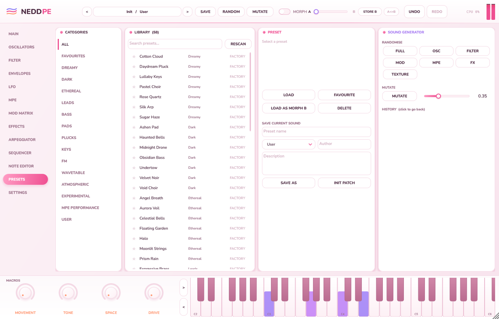

# NeddPE

**An MPE-first hybrid synthesizer (VST3 / Standalone) built with C++20 and JUCE 8.**

Every note is its own instrument: pitch, pressure, slide, velocity and release velocity are tracked per note
and reach oscillators, the filter, the amp, effect sends and even A/B morphing for that note alone. Play a
four-note chord, lean on one finger, and only that note opens its filter, scans its wavetable or swells into the
reverb.



## What is in it

**Sound engine**
- 3 oscillators per note, each **Analog** (PolyBLEP saw/square/pulse with PWM, triangle, sine), **Wavetable**
  (10 procedurally generated, mip-mapped tables with smooth scanning, or **your own imported wavetable**),
  **3-operator FM** (3 algorithms, ratios, fine ratio, feedback, envelope amount, key tracking), **Noise** (white,
  pink, brown, crackle, digital), **Granular** (up to 32 grains: position, size, density, position and pitch spray)
  or **Sample** (pitched playback, one-shot or cross-faded loop)
- **Import** WAV / AIFF / FLAC / OGG files as wavetables (Serum-style frame markers understood) or as samples for the
  granular and sample engines; imported audio is saved inside presets and projects
- Up to 8-voice unison per oscillator with detune and stereo spread, rendered four sub-voices at a time with SIMD;
  cross-FM, **band-limited hard sync**, ring modulation, per-oscillator filter bypass
- **Oscillator oversampling** (Off / Auto / 2x / 4x) against cross-FM, ring and sync aliasing; Auto only
  oversamples the notes that need it
- Per-note filter: LP12/LP24/HP12/HP24/band/notch (TPT state-variable) and a zero-delay-feedback ladder, with drive,
  key tracking, envelope, velocity and mix
- Amp, filter and mod envelopes (delay/attack/hold/decay/sustain/release with curves), draggable on screen
- 3 LFOs (8 shapes including a drawable custom curve), free, retriggered or host-synced, with fade-in
- Poly/mono/legato, glide, polyphony up to 32 with click-free MPE-safe voice stealing
- 12-TET, scales (major, minor, modes, pentatonics, blues, whole tone, octave, user), pitch quantize for bends,
  Scala (.scl) tuning tables

**Modulation**
- 16-slot matrix: 23 sources (MPE pitch/pressure/slide, velocity, release velocity, wheel, bend, aftertouch, 3 LFOs,
  3 envelopes, random, S&H, key, note, gate, 4 macros) to 52 destinations (including grain size and density), with
  curve and polarity per route
- Per-note destinations are evaluated for every voice; effect destinations globally
- Knobs show the reach of their modulation and the live value of the most recent note; the matrix inspector
  explains any destination as base + each route = result
- Right-click any knob: modulate it with any source, remove routes, MIDI learn, reset
- 4 renamable macros, automatable from the DAW

**MPE**
- Lower/upper/both zones, MPE Configuration Message, per-zone bend ranges (RPN 0 or parameter: 12/24/48/any
  1-96), master-channel bend, polyphonic aftertouch, sustain, Legacy mode for ordinary keyboards
- Calibration page with live input meters and pressure / slide / velocity response curves
- Performance view: expression field (pitch x slide x pressure, with trails), per-voice lanes, scrolling
  pitch/pressure/slide timeline, and a routing panel for what each dimension controls
- Playable on-screen MPE keyboard (drag to bend one note, drag vertically for slide, wheel for pressure;
  multi-touch capable)

**Performance and composition**
- Arpeggiator (up, down, up/down, random, order, chord, custom pattern; octaves, gate, swing, ratchet, repeat,
  accent, probability). Arp notes keep following the key that produced them.
- 32-step sequencer: note, velocity, gate, per-step MPE pressure and slide, pitch glide, probability, ratchet, accent
- **Performance recorder + MPE note editor**: record live MPE, then edit notes and draw per-note pitch, pressure and
  slide curves (draw/select/erase, move/resize, copy/paste/duplicate, quantize, humanize, undo/redo)
- MPE MIDI out for generated notes

**Effects**: distortion (5 types, oversampled 1-8x), saturation, bitcrush, chorus, phaser, flanger, stereo/ping-pong
delay and an FDN reverb (both fed by **per-note sends**), 3-band EQ, compressor, output limiter.

**Sound management**: 37 factory presets in 10 categories, user presets with categories, favourites and search,
intelligent randomise (full / oscillators / filter / modulation / MPE / effects / texture), mutation with history,
A/B morph with per-note morph position, full undo/redo, complete state recall in the DAW.

| | |
|---|---|
|  |  |
|  |  |
|  |  |

## Run it without building

Prebuilt Windows x64 binaries of the current version are in [`dist/`](dist):

- `dist/NeddPE.exe`: the standalone app. Double-click it; choose your audio and MIDI devices under *Options >
  Audio/MIDI Settings*.
- `dist/NeddPE.vst3`: the plugin. Copy the whole folder to `C:\Program Files\Common Files\VST3` and rescan in your
  DAW.

If Windows SmartScreen warns about an unrecognised app, choose *More info > Run anyway* (the binaries are not
code-signed). The Visual C++ runtime is linked statically, so nothing else needs installing.

## Build

Requires Visual Studio 2022 (Desktop C++ workload), CMake 3.22+ and Git. JUCE is fetched automatically.

```bash
cmake --preset vs2022
cmake --build --preset release
ctest --preset release
```

The plugin is at `build/NeddPE_artefacts/Release/VST3/NeddPE.vst3`; copy that folder to
`C:\Program Files\Common Files\VST3`. Full instructions: [docs/BUILD.md](docs/BUILD.md).

## Documentation

| | |
|---|---|
| [ARCHITECTURE.md](docs/ARCHITECTURE.md) | Modules, audio-thread flow, threading and real-time safety, state and undo |
| [DSP.md](docs/DSP.md) | Oscillators, anti-aliasing, filters, envelopes, LFOs, matrix, morph, effects |
| [MPE.md](docs/MPE.md) | MIDI handling, zones, per-note model, calibration, recording, MPE out, DAW setup |
| [PARAMETERS.md](docs/PARAMETERS.md) | Every parameter ID, range, default and flag (generated from the code) |
| [BUILD.md](docs/BUILD.md) | Dependencies, configure, build, test, install, troubleshooting |
| [TESTING.md](docs/TESTING.md) | Test suites, VST3 host validation, UI snapshots, performance numbers |
| [PRESET_FORMAT.md](docs/PRESET_FORMAT.md) | The `.neddpe` preset / project state format |

## Project layout

```
CMakeLists.txt, CMakePresets.json
docs/            documentation and screenshots
presets/         factory presets exported as .neddpe files
Source/
  PluginProcessor/  PluginEditor/  Parameters/  MPE/  Voices/  DSP/  Modulation/
  Effects/  Sequencer/  Synth/  Presets/  UI/  Utilities/  Tests/
```

## Status

Version 0.1 was built and verified on Windows 11 with MSVC 19.37 and JUCE 8.0.9: 662 automated checks passed in
Release and Debug with no JUCE assertions, and the VST3 passed host-level validation through JUCE's VST3 hosting.

**Version 0.2** (SIMD unison, band-limited sync, oscillator oversampling, granular and sample engines, wavetable and
sample import, AGPLv3 licence) builds without warnings but **has not been run through the test suite or the
benchmark yet**. Run `ctest --preset release` and `NeddPETests.exe --bench` to check it; the performance table in
[TESTING.md](docs/TESTING.md#performance) is still the 0.1 measurement.

Not done yet (the architecture has room for each; see [ARCHITECTURE.md](docs/ARCHITECTURE.md#extension-points)):

- Not yet tested inside commercial DAWs (Bitwig, Ableton Live, Cubase, Reaper, FL Studio); host notes in MPE.md
  are general guidance
- VST3 Note Expression: not used (MPE arrives as per-channel MIDI, which is how most hosts deliver it)
- Cross-FM is oversampled, not analytically band-limited: very deep cross-FM on high notes can still alias a little
- Wavetable, Sample and Granular sub-voices are rendered one at a time (only Analog and FM unison uses SIMD)
- macOS / AU: not built or tested yet

## Licence

Copyright (C) 2026 Andrew Osei Owusu Sekyere.

NeddPE is free software: you can redistribute it and/or modify it under the terms of the **GNU Affero General Public
License version 3** (or, at your option, any later version) as published by the Free Software Foundation. See
[LICENSE](LICENSE). It is distributed WITHOUT ANY WARRANTY.

Why AGPLv3: NeddPE is built on **JUCE**, which is offered under the AGPLv3 or a commercial licence, and on the
Steinberg VST3 SDK bundled with JUCE, which is offered under the GPLv3 or Steinberg's proprietary licence. Licensing
NeddPE itself under the AGPLv3 makes the whole program use one consistent set of terms, so the compiled binaries in
`dist/` and any you build can be shared legally, as long as whoever receives a binary can also get the complete
source code (this repository) under the same licence.

If you ever want to sell a closed-source version, you would need a commercial JUCE licence (JUCE has a free tier
below a revenue limit) and Steinberg's VST3 licence agreement, and you could then relicense your own code, since
you hold its copyright. See https://juce.com/legal/juce-8-licence/.
